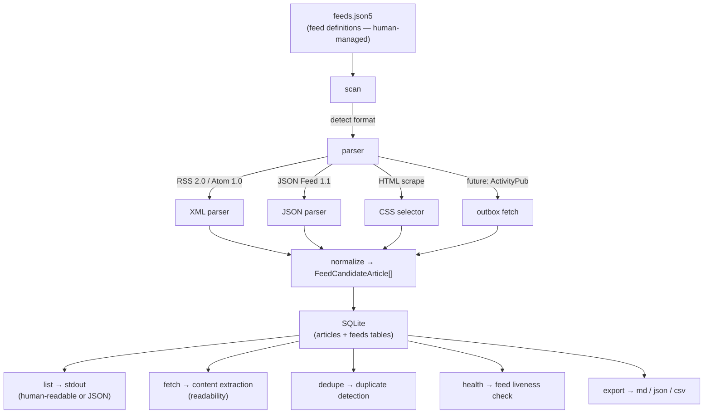

# VISION.md — What feeds-cli aims to be

## In a word

**Own your information pipeline.**

## Why

Keeping up with the web is unavoidable housekeeping for anyone who works with knowledge. Yet most tools optimize for the *reading* experience, not for the *collect → filter → use* pipeline. They assume a human sitting in a GUI.

We want a feed tool that slots into any workflow — scripts, cron jobs, agents, pipes. One that runs on your machine, under your rules, with no external service required.

## Philosophy

### Follow the UNIX way

- Do one thing well.
- Use text streams as the universal interface.
- Compose small programs into larger workflows.

feeds-cli collects and structures articles from feeds. Summarizing, delivering, and displaying them is someone else's job. Pipe it.

### LLM-optional

The entire collect → manage → extract → deduplicate cycle works without an LLM. An LLM is a nice-to-have, never a must-have.

Every command supports `--format json`, so LLMs and agents connect through stdin/stdout naturally. No special integration needed.

### Human-friendly where humans touch, machine-friendly where machines touch

- **Config** (feeds.json5) → humans read and write it → JSON5 (comments, trailing commas)
- **Data** (feeds.db) → machines read and write it → SQLite (flexible queries, crash-resistant, fast)
- **Output** → both → human-readable by default, `--format json` for structure

### One store, many exits

The single source of truth is SQLite. Markdown, JSON, CSV, or any future format is an *interface* concern solved by export. Want to feed a knowledge graph? `--format md`. Want to pipe into `jq`? `--format json`. Storage choice and data utilization are decoupled.

### Local-first

Zero external service dependencies. No API keys. Network is only needed to fetch feeds. All data stays on your machine.

## Design principles

### Non-interactive

Every command is scriptable and cron-friendly. Confirmation prompts can be suppressed with `-y`. Exit codes communicate success or failure.

### Per-feed granularity

Scan, list, and read by feed name. If you have 20 feeds registered, you shouldn't have to poll all of them just to check one.

### Detect broken feeds

Feeds die. URLs change. RSS stops updating. Sites shut down. feeds-cli tracks feed health and surfaces anomalies. Dead feeds don't go unnoticed.

### Fast

Native SQLite, native fetch, native test runner — all from Bun. No external runtime. Fast startup, fast scans, fast queries. For a CLI tool, speed is a feature.

## Supported Feed Formats

| Format | Type | Status |
|--------|------|--------|
| RSS 2.0 | XML (pull) | Planned |
| Atom 1.0 | XML (pull) | Planned |
| JSON Feed 1.1 | JSON (pull) | Planned |
| HTML scraping | HTML + CSS selectors (pull) | Planned |
| ActivityPub/ActivityStreams | JSON-LD (pull outbox / push) | Future |

RSS, Atom, JSON Feed は全て「URL を fetch → パース → 記事一覧」という同じ pull モデル。パーサーを差し替えるだけで対応できる。

ActivityPub は pull (outbox fetch) と push (server-to-server delivery) の両方がありえる。将来対応時は fetch 層の拡張が必要になるが、パース後の記事データは同じ `FeedCandidateArticle` に正規化される設計とする。

## Architecture

## Roadmap

### v0.1 — Foundation

Register feeds, scan, list articles, manage read state. RSS 2.0 / Atom 1.0 / JSON Feed 1.1 + HTML scraping. `--format json` on every command. Usable for daily workflows.

### v0.2 — Curation

Content extraction (readability), deduplication, feed health checks, multi-format export. The layer that turns collected articles into actionable material.

### v0.3 — Distribution

Single-binary build (`bun build --compile`), npm publish, documentation. Make it easy for anyone to use.

### v0.4 — Federation

ActivityPub/ActivityStreams support. Mastodon 等の分散 SNS の outbox を feed source として購読可能に。

### v1.0 — Stable

Incorporate real-world feedback. Stabilize the API. A promise not to break things.

## On the name

`feeds-cli` — the name tells you what it does. No cleverness needed.

---

*This document describes the direction. Implementation details may change. The philosophy won't.*
